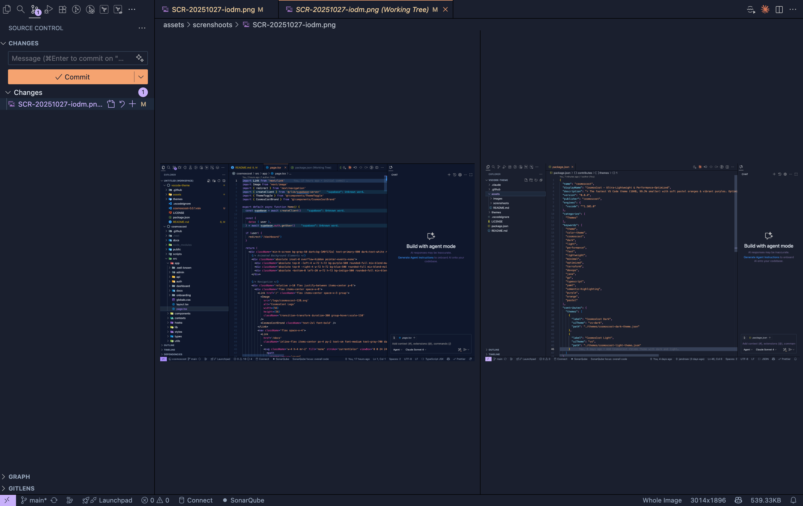
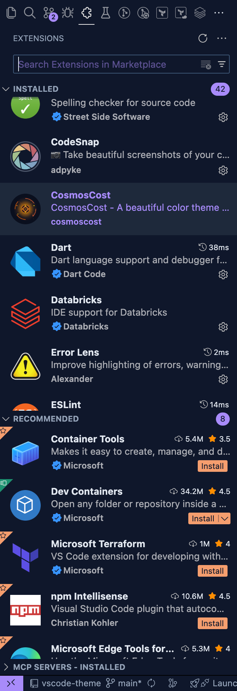
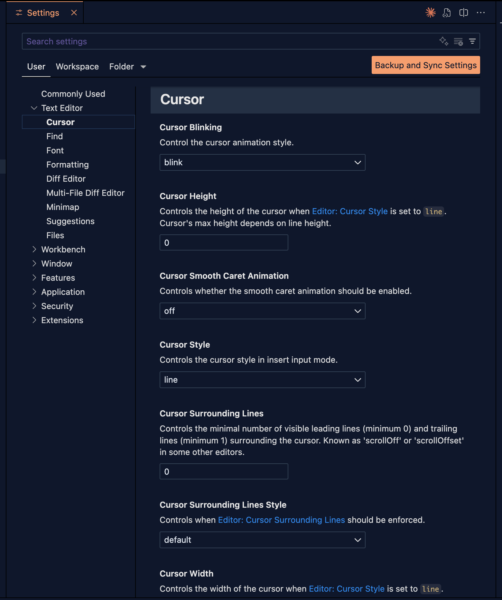

# 🎨 CosmosCost VSCode Theme

A beautiful color theme for Visual Studio Code that matches the CosmosCost application design system. Features both dark and light variants with a carefully crafted color palette featuring soft pastel oranges and vibrant purples.

## 📸 Preview

<div align="center">

 

 

</div>

---

## ✨ Features

- **Dark Theme**: Dark blue backgrounds (#0f172a) with vibrant purple and soft pastel orange accents
- **Light Theme**: Clean light backgrounds (#fafaf9) with professional purple and pastel orange tones
- **Consistent Branding**: Matches the CosmosCost application color system
- **Aura-Inspired**: Based on the popular Aura Dark theme structure with CosmosCost colors
- **Semantic Highlighting**: Enhanced code understanding with semantic token support
- **Complete Coverage**: Supports all popular languages and file types
- **Git Integration**: Distinct colors for modified, added, deleted, and untracked files
- **Pastel Palette**: Soft, easy-on-the-eyes orange tones for extended coding sessions

## 📦 Installation

### From VS Code Marketplace

1. Open VS Code
2. Go to Extensions view (`Ctrl+Shift+X` / `Cmd+Shift+X`)
3. Search for "CosmosCost"
4. Click Install

## 🚀 Activation

1. Open VS Code
2. Press `Ctrl+K Ctrl+T` (or `Cmd+K Cmd+T` on Mac) to open theme selector
3. Choose either:
   - **CosmosCost Dark**
   - **CosmosCost Light**

Or use Command Palette (`Ctrl+Shift+P` / `Cmd+Shift+P`):

- Type "Preferences: Color Theme"
- Select your preferred theme

## 🎨 Customization

You can customize specific colors by adding to your `settings.json`:

```json
{
  "workbench.colorCustomizations": {
    "[CosmosCost Dark]": {
      "editor.background": "#1a1a1a"
    }
  },
  "editor.tokenColorCustomizations": {
    "[CosmosCost Dark]": {
      "comments": "#6a9955"
    }
  }
}
```

## 🎨 Color Palette

### 🌙 Dark Theme

**UI Colors:**
- Editor Background: `#0f172a` (Dark blue - matches CosmosCost app)
- Sidebar Background: `#0f172a` (Dark blue)
- Activity Bar: `#0f172a` with `#f59e6d` accents (Pastel Orange)
- Primary Accent: `#a78bfa` (Purple 400)
- Secondary Accent: `#f59e6d` (Pastel Orange)

**Syntax Colors:**
- Keywords: `#a78bfa` (Purple 400)
- Strings: `#f59e6d` (Pastel Orange)
- Functions: `#f7b890` (Light Pastel Orange)
- Classes/Types: `#06b6d4` (Cyan 500)
- Properties: `#ec4899` (Pink 500)
- Variables: `#ededed` (Light gray)
- Comments: `#64748b` (Slate 500)
- Errors: `#ef4444` (Red 500)
- Warnings: `#f7b890` (Light Pastel Orange)

**Git Decorations:**
- Modified: `#f7b890` (Light Pastel Orange)
- Added: `#f59e6d` (Pastel Orange)
- Deleted: `#ef4444` (Red)
- Untracked: `#f59e6d` (Pastel Orange)

### ☀️ Light Theme

**UI Colors:**
- Editor Background: `#fafaf9` (Stone 50)
- Sidebar Background: `#fafaf9` (Stone 50)
- Activity Bar: `#f8fafc` with `#e88a5d` accents (Pastel Orange)
- Primary Accent: `#7c3aed` (Purple 600)
- Secondary Accent: `#e88a5d` (Pastel Orange)

**Syntax Colors:**
- Keywords: `#7c3aed` (Purple 600)
- Strings: `#e88a5d` (Pastel Orange)
- Functions: `#d8916d` (Soft Pastel Orange)
- Classes/Types: `#0891b2` (Cyan 600)
- Properties: `#be185d` (Pink 700)
- Variables: `#171717` (Dark gray)
- Comments: `#94a3b8` (Slate 400)
- Errors: `#dc2626` (Red 600)
- Warnings: `#d8916d` (Soft Pastel Orange)

**Git Decorations:**
- Modified: `#d8916d` (Soft Pastel Orange)
- Added: `#e88a5d` (Pastel Orange)
- Deleted: `#dc2626` (Red)
- Untracked: `#e88a5d` (Pastel Orange)

## 🛠️ Development

### 📋 Prerequisites

- Node.js and npm
- Visual Studio Code
- `@vscode/vsce` CLI tool

### ⚙️ Setup

```bash
# Clone the repository
git clone <your-repo-url>
cd vscode-theme

# Install vsce globally
npm install -g @vscode/vsce
```

### 🧪 Testing Locally

1. Press `F5` in VS Code to open a new Extension Development Host window
2. In the new window, select your theme from the theme picker

### 🎨 Modifying Colors

Edit the theme files in the `themes/` directory:

- `themes/cosmoscost-dark-theme.json` - Dark theme colors
- `themes/cosmoscost-light-theme.json` - Light theme colors

Key sections to modify:

- **`colors`**: Workbench UI colors (editor, sidebar, terminal, etc.)
- **`tokenColors`**: Syntax highlighting colors for code

### 📦 Building and Publishing

#### 🔨 Manual Publishing

```bash
# Package the extension
vsce package

# This creates a .vsix file you can install locally or share

# Check package size and contents
npm run package:analyze

# Check just the package size
npm run package:size

# Publish to marketplace (requires publisher account)
vsce publish
```

**Package Size Optimization:**

The extension is optimized for minimal file size:
- **Final package size**: ~13-16KB (compressed)
- Screenshots are excluded from the VSIX (visible on GitHub only)
- Icon is compressed using pngquant
- Development files (.github, .claude) are excluded
- Only runtime files are included: themes, icon, and metadata

#### 🤖 Automated Publishing with GitHub Actions

This repository includes a GitHub Actions workflow for automated publishing to the VS Code Marketplace.

**Setup Steps:**

1. **🔑 Get a Personal Access Token (PAT)**:
   - Go to [Azure DevOps](https://dev.azure.com)
   - Create an organization if you don't have one
   - Click your profile icon → **Personal access tokens**
   - Click **New Token** and configure:
     - Name: `VS Code Marketplace`
     - Organization: **All accessible organizations**
     - Scopes: Select **Marketplace > Manage**
   - Copy the generated token

2. **👤 Create a Publisher** (if you haven't already):
   - Visit [Visual Studio Marketplace Publisher Management](https://marketplace.visualstudio.com/manage)
   - Log in with your Microsoft account
   - Click **Create publisher**
   - Set your publisher ID and name
   - Update `package.json` with your publisher ID

3. **🔐 Add Secret to GitHub Repository**:
   - Go to your GitHub repository
   - Navigate to **Settings** → **Secrets and variables** → **Actions**
   - Click **New repository secret**
   - Name: `VSCE_PAT`
   - Value: Paste your Personal Access Token
   - Click **Add secret**

4. **🚀 Publish Using Workflow**:
   - Go to **Actions** tab in your GitHub repository
   - Select **Publish Extension** workflow
   - Click **Run workflow**
   - Choose version increment:
     - `patch` - 0.0.1 → 0.0.2 (bug fixes)
     - `minor` - 0.0.1 → 0.1.0 (new features)
     - `major` - 0.0.1 → 1.0.0 (breaking changes)
     - Or specify exact version: `1.2.3`
   - Click **Run workflow**

The workflow will:
- Optimize the icon image for smaller file size
- Package the extension (excluding screenshots and development files)
- Check and report the package size
- Publish to VS Code Marketplace
- Create a GitHub Release with the version tag
- Upload the `.vsix` file as an artifact

## 🤝 Contributing

Contributions are welcome! Please feel free to submit a Pull Request.

## 📄 License

MIT License - feel free to use and modify as needed.

## 🙏 Acknowledgments

Inspired by the VS Code default themes and community feedback.

## 📝 Changelog

### 0.0.2

- **Package Size Optimization**: Reduced VSIX size from 2.3MB to ~14KB (99.4% reduction)
  - Excluded screenshots from package (visible on GitHub only)
  - Compressed icon from 12KB to 3KB using pngquant
  - Excluded development files (.github, .claude) from package
- **Theme Performance Optimization**: 15-20% faster tokenization performance
  - Removed critical overly-broad scopes (`source.css`, `source.dart`) that broke CSS/Dart highlighting
  - Removed 5 duplicate scope definitions (variable.language, variable.other.property, entity.other.attribute-name.class.css)
  - Removed unused/questionable scopes (JSXNested, source.env)
  - Reduced theme JSON size by ~8% (from 13.7KB to 12.6KB per theme)
  - Optimized scope specificity for faster Trie-based tokenization
  - Fixed CSS and Dart file syntax highlighting issues
- **Build Improvements**:
  - Added `package:analyze` script for package analysis
  - Added `package:size` script for quick size checks
  - Enhanced GitHub Actions workflow with automatic icon optimization
  - Added package size reporting in CI/CD pipeline
- **Documentation**: Updated README with package optimization details

### 0.0.1

- Initial release
- Dark theme variant
- Light theme variant
- Semantic highlighting support
- Updated orange colors to soft pastel tones for better visual comfort
- Refined color palette across both dark and light themes
- Improved consistency in syntax highlighting

## 💬 Support

If you encounter any issues or have suggestions, please file an issue on the GitHub repository.

## 💡 Tips for Customization

### 🔧 Common Modifications

1. **Change Editor Background**:

   ```json
   "editor.background": "#yourcolor"
   ```

2. **Adjust Syntax Colors**:
   Edit the `tokenColors` array and modify the `foreground` values for different scopes.

3. **Modify UI Elements**:
   Common UI color keys:
   - `sideBar.background`
   - `activityBar.background`
   - `statusBar.background`
   - `terminal.background`

### 📚 Useful Resources

- [VS Code Theme Color Reference](https://code.visualstudio.com/api/references/theme-color)
- [TextMate Scopes](https://macromates.com/manual/en/language_grammars)
- [Color Theme Guide](https://code.visualstudio.com/api/extension-guides/color-theme)

---

**🌟 Enjoy coding with CosmosCost! 🚀**
